# cohort-skills

A Claude Code skill that finds what smart money is **converging on** right now, then watches those same wallets for **exits** — composed from real [OKX OnchainOS](https://github.com/okx/onchainos-skills) commands.

<p align="center">
  
</p>

> **Not a trading bot.** COHORT is an analysis + alerting workflow. The only trade path is gated by a hard-stop confirmation phrase. See `skills/cohort/references/safety-gates.md`.

> **To record a real terminal GIF later:** install [vhs](https://github.com/charmbracelet/vhs) and run `vhs docs/demo.tape` (a tape file isn't included yet — `docs/demo.svg` is the current animated placeholder, served inline by GitHub on the README).

## What COHORT does

1. **Discover** — pulls smart-money buy signals (`onchainos signal list`) and aggregates by token, ranking by how many distinct SM wallets are converging.
2. **Assess** — for each top cohort token, fetches price, market cap, liquidity, honeypot, tax, mint/freeze authority status.
3. **Watch the same wallets for sells** — uses `onchainos tracker activities --tracker-type multi_address --trade-type 2` to detect when cohort members start exiting. This closes the loop that buy-only signal feeds normally leave open.
4. **Verdict** — `FOLLOW`, `WATCH`, or `AVOID` based on convergence size, safety flags, and exit activity.
5. **Optional gated follow** — if the user explicitly asks, COHORT quotes + simulates, then **stops and requires the user to type an exact confirmation phrase** before any swap is broadcast.

## Quick start

```bash
# 1. Demo mode (no CLI, no network — always works)
python3 skills/cohort/scripts/cohort.py run --demo

# 2. Generate and serve the HTML report
python3 skills/cohort/scripts/cohort.py run --demo --json-out report.json
python3 skills/cohort/scripts/report.py --input report.json --output cohort-report.html
python3 skills/cohort/scripts/serve.py
# → http://localhost:8765/cohort-report.html

# 3. Dry-run against the real CLI (requires onchainos installed)
python3 skills/cohort/scripts/cohort.py run --dry-run

# 4. Gated follow (always prints HARD STOP; never broadcasts here)
python3 skills/cohort/scripts/cohort.py follow \
  --symbol WEN --token EKpQGSJtjMFqKZ9KQanSqYXRcF8fBopzLHYLWbWQX1xx \
  --amount 0.1 --chain solana --demo
```

## Using as a Claude skill

### Prerequisites

COHORT composes commands from the upstream [`okx/onchainos-skills`](https://github.com/okx/onchainos-skills) plugin. Install both pieces:

```bash
# 1. Install the onchainos CLI binary
curl -sSL https://raw.githubusercontent.com/okx/onchainos-skills/main/install.sh | sh

# 2. Install the upstream skills plugin so its SKILL.md files are discoverable
mkdir -p ~/.claude/plugins/marketplaces
git clone https://github.com/okx/onchainos-skills.git \
  ~/.claude/plugins/marketplaces/onchainos-skills
```

Verify:

```bash
onchainos --version       # → onchainos 3.3.6 (or newer)
ls ~/.claude/plugins/marketplaces/onchainos-skills/skills | head
```

### Add COHORT

Drop `skills/cohort/` into your Claude Code skills directory. The skill triggers when the user asks about smart money convergence, cohort behavior, or watching multi-wallet sells.

### About the OKX paid quota

The OKX Market API has a free quota per installation. Past that quota the CLI returns `{ "confirming": true, ... }` and exits non-zero. COHORT detects this and falls back to demo mode with a clear in-band message — it does not auto-pay. To get live data through COHORT, resolve the payment gate through the upstream `okx-agent-payments-protocol` skill first.

## What's in this repo

| Path | Purpose |
|---|---|
| `skills/cohort/SKILL.md` | The skill definition (YAML frontmatter + workflow) |
| `skills/cohort/scripts/cohort.py` | The composition engine |
| `skills/cohort/scripts/report.py` | HTML report renderer |
| `skills/cohort/scripts/serve.py` | localhost HTTP server for the report |
| `skills/cohort/scripts/demo_data.json` | Bundled fixtures for demo mode |
| `skills/cohort/references/onchainos-commands.md` | Cross-reference of every CLI command used to the upstream OnchainOS file that defines it |
| `skills/cohort/references/safety-gates.md` | The three serial gates protecting the swap-execute path |
| `docs/DEMO.md` | Step-by-step walkthrough a stranger can follow |
| `NOTES_FROM_REPO.md` | Honest accounting of what's verified vs substituted |
| `BUILD_LOG.md` | Exact commands run during build + what was observed |
| `tests/` | YAML frontmatter + input-validation tests |

## No CI

Intentional. The 12-check verification is documented in `BUILD_LOG.md` and was run by hand. A red CI badge that lies is worse than no badge.

## License

MIT.
